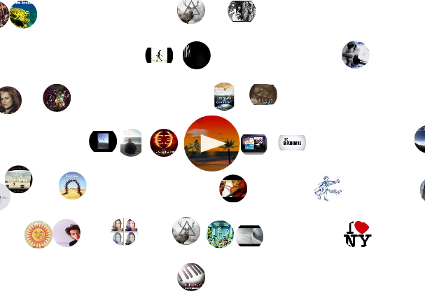

Js Music Player
===============

#### Nice audio player that arranges and queues the tracks according to their key and tempo



####[TRY IT ONLINE](http://gto76.github.io/js-music-player/js/collision.html)

Features
--------

* Tempo is represented by the x axis, in such a way that all multiples of two are projected to the same value (eg. songs with 120BPM and 60BPM have the same x value).
* Key is represented by the y axis. Keys are arranged in the circle of fifths. That way the closer they are, more consonant the interval sounds.
* Because of the cyclic projection of the key and tempo, the scrolling could be made infinite (it is not yet implemented).
* Autoplay based on distance.
 
How to run locally
-----------------
```
$ git clone https://github.com/gto76/js-music-player
$ cd js-music-player/js
$ sensible-browser collision.html
```
